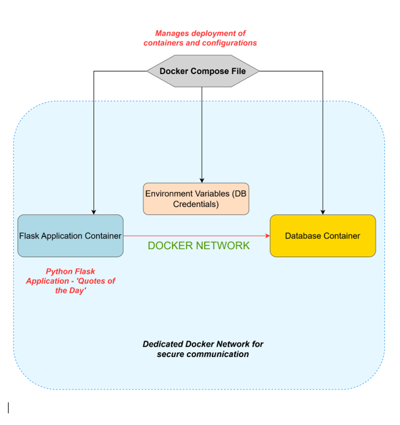

# Creating-A-Multi-Container-Application-Using-Docker-Compose
This project implements a multi-container architecture using Docker Compose to deploy a Python Flask application alongside a database in separate, networked containers. This setup isolates application and database services for modular development, easy scalability, and improved fault tolerance.

# Usage

1. Update the environment variables in the .env file

2. To start the environment
    Command: docker-compose up

3. To stop the environment
    Command: docker-compose down

4. To rebuild after application code update
    Command: docker-compose up --build

# WHAT HAS BEEN ACCOMPLISHED:
1. Written application code for a 'Quotes of the Day' Flask Application.
2. Created a Dockerfile to package the application in a Python container image.
3. Created a Docker Compose file to set up a multi-container architecture, orchestrating both the Flask application and database containers.
4. Configured a dedicated network within Docker Compose for seamless communication between the application and database containers.
5. Implemented environment variables in the Docker Compose file to securely manage database credentials and application configurations.
6. Tested and validated database connectivity and functionality, ensuring the application retrieves quotes as intended.

# Simple Architecture:
